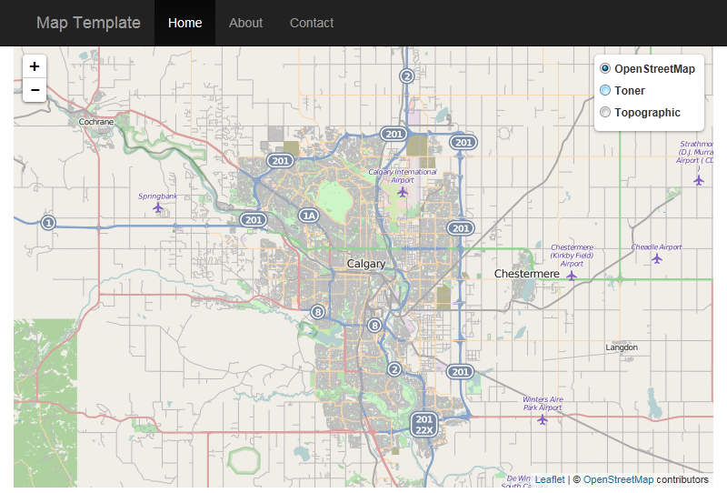

# Leaflet Template

A webmap template using the [Leaflet](http://leafletjs.com) mapping JavasScript library and [Bootstrap](http://getbootstrap.com).

The template is preloaded with layers from:
- [OpenStreetMap](https://www.openstreetmap.org)
- [Stamen](http://stamen.com)
- [Esri](http://esri.com)

## Usage
- Download the files
- Remove the base layers you don't need
- Add the layers important to you
- Change the About and Contact modals
- Change the title
- Deploy

